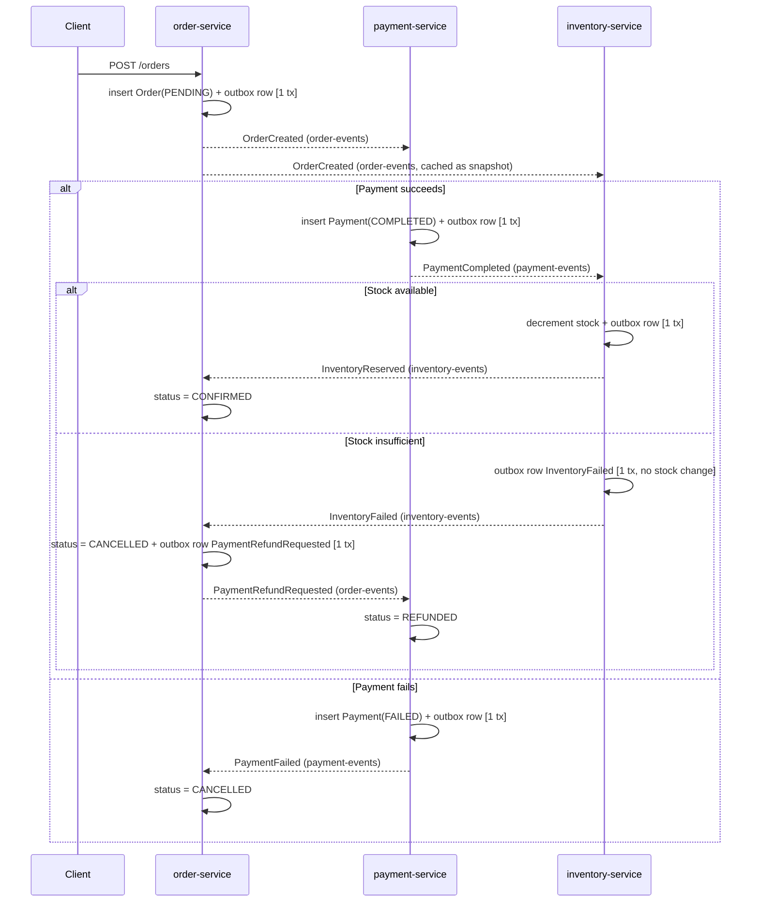

# Event Order System (Rust)

Rust port of the [Java/Spring Boot version](../event-order-system) — same distributed saga, same
guarantees, different runtime. Three services (`order-service`, `payment-service`,
`inventory-service`) built on `axum` + `sqlx` + `rdkafka`, talking to each other exclusively
through Kafka (Redpanda), with no orchestrator.

## Architecture

Choreography-based saga: each service reacts to events published by its neighbors and decides
what to do next. There is no central coordinator.



## Patterns implemented (same as the Java version, different mechanics)

**Transactional outbox.** Every state change and the event describing it are written in the same
`sqlx` transaction (see `service::create_order`, `service::process_payment`,
`service::reserve_for_order`). A `tokio::time::interval` background task (`outbox::run_publisher`)
polls unpublished rows and ships them to Kafka separately, closing the dual-write hole.

**Idempotent consumers.** Each service keeps a `processed_events` table keyed by `event_id`. The
check-and-insert happens in the same transaction as the business effect (see the `saga` module in
each crate), so redelivery is a guaranteed no-op.

**Choreographed saga with compensation.** When inventory can't be reserved after payment already
succeeded, `order-service` cancels the order *and* emits `PaymentRefundRequested` — a compensating
transaction that undoes the earlier step, visible directly in `saga::handle_inventory_event`.

**Dead-letter queues.** `kafka::consume_loop` (duplicated per service — see below) retries a
failing handler with exponential backoff (1s → 15s cap) and, after 5 attempts, publishes the raw
envelope to `<topic>.DLT` and moves on, so one poison message can't block the partition.

**Row-level locking.** `inventory-service` locks every `stock` row touched by an order with
`SELECT ... FOR UPDATE`, sorted by product ID first to avoid deadlocking two orders that both
touch multiple products — same reasoning as the pessimistic lock in the Java version, expressed
directly in SQL since sqlx has no ORM-level lock annotation to lean on.

**Cross-topic read model.** `inventory-service` caches order line items from `OrderCreated` into
`order_snapshots` and reads that cache when `PaymentCompleted` arrives. If the snapshot hasn't
landed yet (consumer lag across topics), `reserve_for_order` returns an error and the retry/DLQ
logic in `consume_loop` gives it another shot.

## Where this diverges from the Java version, and why

- **No dependency injection / repository interfaces.** Rust doesn't reward that indirection the
  way Spring does — `db.rs` in each crate is just async functions taking a generic
  `impl PgExecutor`, callable with either a pool or an open transaction. Less ceremony, same
  guarantee (queries can run standalone or inside a caller-controlled transaction).
- **`consume_loop` is duplicated per service instead of shared.** Rust's async closures needed to
  parameterize a retry/DLQ loop are simple to write per-call-site but genuinely awkward to
  abstract over multiple handler signatures without a `Box<dyn Future>` allocation on every
  message. Three ~100-line copies were judged cheaper to maintain than that indirection for a
  project this size — the same tradeoff Java resolves for free via `DefaultErrorHandler` beans.
- **No Spring-style transaction propagation.** In the Java version, `@Transactional` methods
  calling other `@Transactional` methods join the same transaction automatically. Rust has no
  equivalent, so `saga.rs` in each service owns the transaction directly and calls plain
  `service`/`db` functions with an explicit `&mut PgConnection` — more explicit, not more correct.
- **rdkafka's consumer has no built-in consumer-group rebalance story exercised here.** Each
  service runs a single instance per topic subscription (same as the demo's Java setup, which
  also never scales a service past one replica) — group IDs are set for correctness/parity, not
  because this code has been tested under rebalancing.

## Running it

Requires Docker, Rust 1.75+, and (for `rdkafka`) `cmake` + `pkg-config` + `librdkafka-dev` on the
build machine:

```bash
sudo apt-get install -y cmake pkg-config librdkafka-dev   # Debian/Ubuntu
```

```bash
# 1. Infra: Redpanda, Postgres (3 databases), Prometheus, Redpanda Console
docker compose up -d

# 2. Build
cargo build --release

# 3. Run each service in its own terminal
./target/release/order-service
./target/release/payment-service
./target/release/inventory-service
```

- Redpanda Console: http://localhost:8080
- Prometheus: http://localhost:9090
- order-service health: http://localhost:8081/actuator/health
- payment-service health: http://localhost:8082/actuator/health
- inventory-service health: http://localhost:8083/actuator/health

## Trying the saga

```bash
# Happy path (PROD-1 has 100 units in stock)
curl -s -X POST http://localhost:8081/orders \
  -H 'Content-Type: application/json' \
  -d '{"customerId":"cust-1","items":[{"productId":"PROD-1","quantity":2,"unitPrice":19.99}]}' | jq

curl -s http://localhost:8081/orders/<id> | jq

# Inventory-failure + refund compensation path (PROD-3 only has 5 units)
curl -s -X POST http://localhost:8081/orders \
  -H 'Content-Type: application/json' \
  -d '{"customerId":"cust-2","items":[{"productId":"PROD-3","quantity":50,"unitPrice":9.99}]}' | jq
```

Payment failures are simulated at a configurable rate (`PAYMENT_SIMULATED_FAILURE_RATE`, default
`0.2`) so you can watch both the happy path and the compensation path without touching code.
